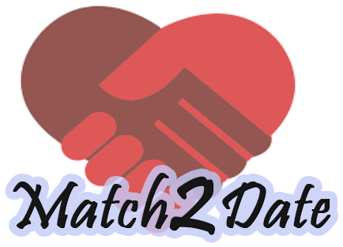

# Grupa11-TimCodeBusters

## Online upoznavanje Match2Date

  

## Èlanovi tima:

1. Aganoviæ Asim
2. Begoviæ Hamza
3. Teroviæ Amar

## Opis teme

Svrha aplikacije je da pojednostavi i omoguæi stupanje u kontakt i dogovaranje sastanaka izmeðu osoba suprotnog spola. Ukoliko tražite savršenu osobu za sastanak, registrujte se na Match2Date. Korisnici na vrlo jednostavan naèin stupaju u kontakt s osobom s kojom dijele zajednièke interese. Uz obostranu saglasnost, spajanje poèinje. Dogovaranje sastanaka nikada nije bilo lakše!

## Procesi

#### Kreiranje korisnièkog raèuna
Korisnik se registruje unoseæi e-mail adresi i šifru. Prilikom registracije on vrši upload slika te unosi liène i kontakt podatke. Opcionalno, može prilagoditi prikaz osoba odabirom raspona godina i maksimalne udaljenosti.

#### Pregled profila
Korisnik ima moguænost pregleda profila osoba suprotnog spola (u blizini). Prikazuje se nekoliko slika i kratka biografija, kao i prosjeèna ocjena, dodijeljena od drugih korisnika, ako postoji. Korisnik može koristiti filtere za prikaz samo osoba odreðene starosne dobi ili na maksimalno odreðenoj udaljenosti od njegove trenutne lokacije.

#### Uparivanje korisnika
Na osnovu pregleda profila korisnik bira osobe koje mu se svide i s kojima želi daljnju komunikaciju (oznaèava ih sa "sviða mi se"). U sluèaju da je pokazan interes sa obje strane, upareni korisnici primaju obavijest o tome. Takoðer, dobivaju moguænosti pregleda ostalih informacija s profila i komunikacije. Upareni korisnici imaju i moguænost meðusobnog ocjenjivanja od 1-5, kao generalni utisak o drugom korisniku. Ocjena æe se prikazivati na profilu prilikom pregleda.

#### Ažuriranje profila
Korisnik ima moguænost naknadnog ažuriranja informacija na svom profilu. Dodavanje novih slika, uklanjanje postojeæih. Takoðer, postoji moguænost deaktiviranja profila od strane korisnika. Deaktivirani profil se ne prikazuje u pretraživanjima i onemoguæen mu je pristup do ponovne aktivacije. Profil se opet može aktivirati na zahtjev korisnika.

#### Brisanje profila
Brisanje profila vrši administrator. Brisanje profila može tražiti sam korisnik, a može biti i posljedica kršenja pravila npr. lažno predstavljanje, dupli profili, prijave drugih korisnika itd. 

#### Prijave profila
Korisnici mogu prijavljivati profile drugih korisnika uz navedene razloge. Validni razlozi mogu biti: lažno predstavljanje, uznemiravanje, korištenje tuðih slika, pravljenje duplih profila itd. Administrator provjerava opravdanost prijava i u skladu s tim reaguje.

## Funkcionalnosti

- Kreiranje korisnièkog raèuna
- Deaktiviranje korisnièkog raèuna
- Prikaz drugih korisnika u blizini
- Prilagoðeni prikaz drugih korisnika na osnovu broja godina i maksimalne udaljenosti od trenutne lokacije
- Odabir jedne od moguænosti: “Sviða mi se” i “Ne sviða mi se” na osnovu prikaza nekoliko slika i kratke biografije
- Uspostava kontakta izmeðu korisnika
- Ostavljanje generalnog utiska o drugom korisniku nakon komunikacije u vidu ocjene 1 - 5
- Ažuriranje postojeæeg korisnièkog raèuna
- Prijava drugih korisnika zbog kršenja pravila
- Moguænost trajnog brisanja korisnièkih raèuna od strane administratora
- Uvid u razlièite statistièke podatke od strane administratora  
 
## Akteri

1. Korisnik - Osoba koja se registrovala na aplikaciju. Može vidjeti osobe u blizini te na jedinstven naèin iskazati svoju zainteresiranost. Zatim, u moguænosti je vidjeti detaljnije informacije i poslati privatnu poruku osobama sa kojima je uparen. Konaèno, ima moguænost ocjenjivanja osoba s kojima je uparen ocjenom od 1-5, kao i moguænost prijave drugih korisnika zbog kršenja pravila.

2. Administrator - Osoba koja ima uvid o svim registriranim korisnicima. Upravlja bazom podataka, razmatra prijave korisnika i ima moguænost brisanja korisnièkih profila. Kreira i pregleda razne statistièke izvještaje u svrhu unaprijeðenja aplikacije.
